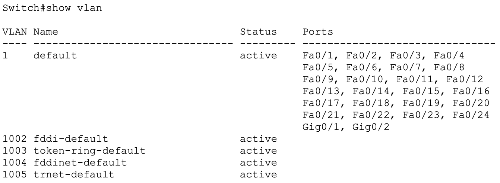
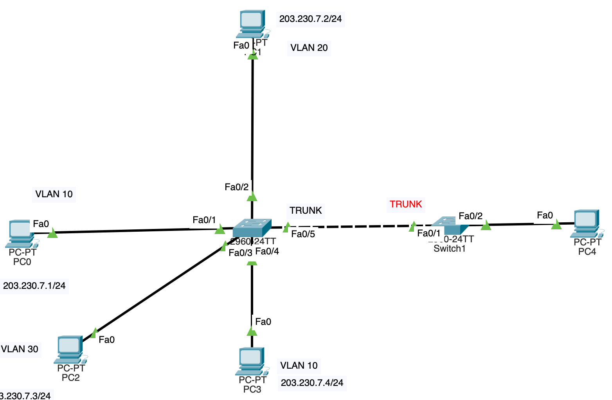
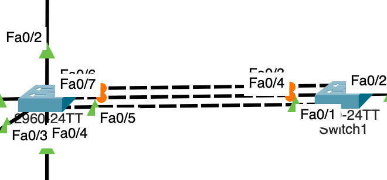

# VLAN (Virtual Local Area Network)

기본적으로, `Flooding`은 오버헤드이다. 따라서 네트워크 사이즈에 따라 손실이 커진다.

이를 방지하기 위해 `L2`에서는 `VLAN`을 사용한다.

이는 물리적 Topology와 논리적 Topology를 분리한다.

동일한 `VLAN`에 속한 포트는 동일한 네트워크로 간주한다.

> `# show vlan`

이처럼 모두 기본적으로는 `Default VLAN`에 속한 것을 볼 수 있다.

`VLAN`을 나누게 되면 보안성이 향상된다.(기본포트 바꾸는 것과 같은 이치)

## Inter-VLAN

서로 다른 `VLAN`끼리의 통신은 `L3`을 경유해야 한다.
서로 다른 네트워크로 간주되기 때문이다.

이 경우, 보안성의 향상이라는 장점이 사라진다.

## TRUNK Port

모든 VLAN이 통신할 수 있는 포트.
큰 네트워크에서는 반드시 Bottle Neck 현상이 생기므로
Asymmetric Switching이 필요한 경우가 생긴다..

다음과 같은 Extended Topology에서 각 Switch 간을 지나는 통신을 위해 필요하다.

이 또한 TRUNK Port를 지날 때 Snipping이 가능해 보안상 취약점이 존재한다.

이를 막기 위해 VLAN 수만큼 Switch 사이에 포트를 두는 경우도 있다.

## Symmetric Switching & Asymmetric Switching

## LAN Segmantation
