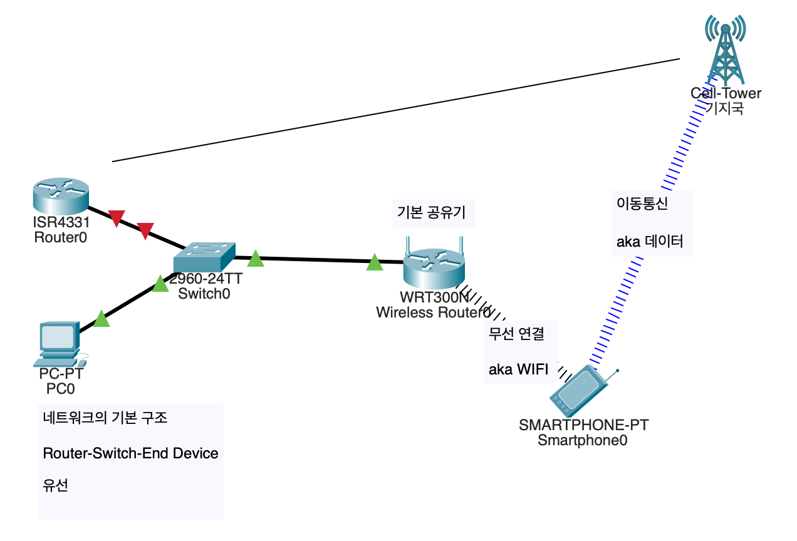
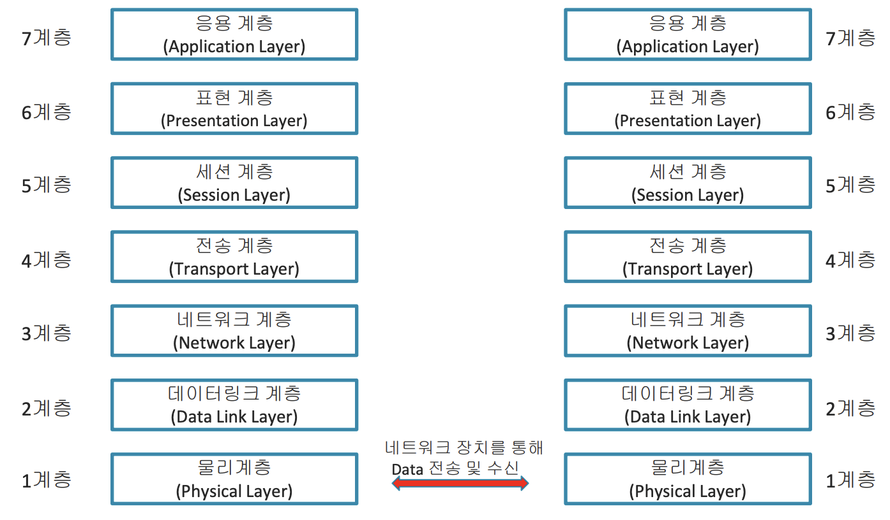
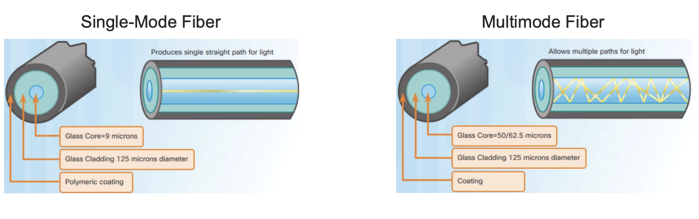

### Converged Network

    wireless router, switch 등등을 컴포넌트화해 하나의 라우터에서 운영하게 함
    경제적으로 이득 

### 가상화

### ML 기반의 네트워크 자동화

    컨버지드+가상화 네트워크를 기존의 네트워크처럼 볼 수 있어야 함 
    머신러닝 내부에서 학습되지 않은 케이스는 처리 못함
    네트워크 하기 어려워짐 

### AI 기반의 네트워크 자동화

    지가 알아서 다 함 

***

클라우드사의 전송 알고리즘

하드웨어뿐 아니라 소프트웨어도 함께 나옴 << 가상화
***
### Switch

End Device끼리 연결해줌

여기에서 각 디바이스를 구분해주는 것이 IP Address이다.

#### MAC Address Table

ARP로 파밍한 MAC Address가 저장되고 이후 ICMP 전송 시 참조됨

300초의 Aging Time 동안 통신기록이 없는 경우 Mac Table에서 삭제된다.

##### 형식

|Vlan|Mac Address|Type|Ports|
|:-:|:-:|:-:|:-:|
|1|0001.2133.f3c5|DYNAMIC|Fa0/1|

### Router

기본적으로 DHCP Server로서 작동함.

Routing Portocol을 통해 Routing Table을 생성한다. (안배울거임)

### DHCP

ip 동적으로 할당해주는 프로토콜

### ICMP

Echo Request(ping)와 Echo Response로 구성됨.

각 End끼리의 연결성을 확인함

내부적으로 ARP 사용

### ARP Protocol
    Source와 Destination의 IP주소(INPUT)와 Source의 MAC주소를 통해
    Destination의 MAC 주소를 알아내는 프로토콜.

    네트워크 내부의 모든 End를 탐색하며 IP를 비교하여 찾는다.

    MAC 주소를 모를 경우 FFFF로 반복되는 주소를 띄운다

    첫 탐색 이후, MAC주소는 저장된다. 따라서 이후의 ICMP에서는 ARP packet을 보내지 않는다.

***

(4계층부터 SoftWare 계층임)

| Layer | Device | Method | Data |
|:-:|:-:|:-:|:-:|
| L1 | NIC(랜 카드) | 케이블(Port) |w|
| L2 | Switch(S/W) | MAC Address | Frame |
| L3 | Router | IP Address | Packet |
| L2 | Switch(S/W) | w |  |
| L2 | Switch(S/W) | w |  |
| L2 | Switch(S/W) | w |  |
| L2 | Switch(S/W) | w |  |

### L1 - Physical Layer

* (DC)전기신호로 전달되는 사용자 데이터를 물리 매체 상에서 통신 
* 가능한 신호로 변환하는 계층 
* 전기적/기능적/절차적/물리적 특성을 지님
* Bandwidth(대역폭)를 가짐
* bit 단위로 데이터를 전송

Hub, 리피터, 랜 카드 등이 속한다.

#### 케이블 - UTP Cables
- 다이렉트 케이블: 다른 레이어끼리 연결
- 크로스오버 케이블: 동일 레이어끼리 연결

##### [Auto-MDIX](https://www.hp.com/hpinfo/abouthp/iplicensing/automdix.html)

랜 카드에 적용되는 기술로, HP사에서 개발한 장치로 각 장치를 케이블의 구분 없이 연결 가능하게 해 줌 

##### 광 케이블

단거리(수 M)에서는 SMF를, 그 이상의 장거리에서는 MF를 사용한다.