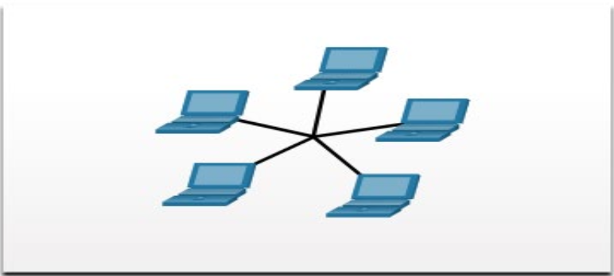

NIP의 Mac Address는 공장에서 ROM 내부에 찍혀나오는 것이므로 임의로 변경이 불가능하다. (근데 최근에는 가상으로 변경 가능)

이 때문에 Mac Address의 기기 간 중복 방지를 위한 표준이 존재한다.

### Topology 

네트워크의 구성을 일목요연하게 정리한 도표. 각 기기의 주소를 포함한다.

### 통신의 유형

#### unicast - 1:1 통신

    특정 기기에게 보냄

Switch에 MAC Table이 구성되어야 가능

- ICMP

#### multicast - 1:N 통신 (그룹 정의 가능)

    특정한 그룹에 속한 기기에 보냄

#### broadcast - 1:N 통신 (그룹 정의 불가능)

    네트워크 내 모든 기기에 보냄

mac address가 FFFF:FFFF...면 broadcast

- ARP

### L1의 Toplogy

#### Star Topology

1대의 Switch에 모든 End Device가 연결된 형태

#### Extended Star Topology

각 Star Topology의 Switch끼리 연결된 형태

이중화 필요

##### Single Point Failure
위에서 언급된 연결이 끊어지는 경우를 말함

#### Ring Topology

SRF를 해결하기 위해 연결을 2개 이상으로 하는 것

실제로는 위 3개를 섞어 씀

#### Bus Tolpology

회선에 장착하는 Tap을 통해 각 End Device가 연결됨

망 종단장치를 이용함

현재는 거의 사용 안 함

### L2 - Datalink Layer

이기종의 주변 네트워크 장치끼리 데이터를 주고받음

MAC Address 기반

    Mac Address는 48bit에 16진수를 사용한다.

스위치 기반의 L2 보안도 가능(특정 기기에서 특정 기기로의 Frame 전송 Forwarding 금지 가능)

#### CSMA/CD - Carrier Sense Multiple Access / Collision Detection

회선을 공유하지 않는 특성을 지닌 정보 교환 프로토콜

##### Collision Domain

하나의 회선 내에서, 다른 데이터 공유가 일어나는 경우에 데이터 공유를 하지 못하는 디바이스의 최소 그룹 단위

이를 쪼개는 것을 Segmentation이라 한다.

##### Carrier Sensing

위 상황에서 회선이 점유 중인지 감지하는 과정

exponential backoff를 통해 랜덤한 retransmission 대기시간을 할당한다.

Switch의 역할 중 하나는 해당 Collision Domain 내에서 연결된 각 디바이스를 포트별로 나누어 별개의 독립적인 CD인 것처럼 다룰 수 있게 해 주는 것이다. 따라서 동시적인 데이터 교환이 가능하다.

#### MAC Table의 완성

Switch는 broadacasting 된 ARP를 받고 Frame을 복사하여 모든 장치에 Flooding한다.
이에 대한 응답은 unicast로 온다.

#### MTU - Maximum Transfer Bytes

1504 bytes

* ethernet: 10M
* fast ethernet, Fa: 100M
* giga ethernet: 1000M

만약 기가로 10대가 동시에 스위치에 데이터를 전송하면 스위치는 터진다.
따라서 MTU만큼씩 쪼개서 보낸다.

이렇게 쪼개는 것을 Segmentation이라 한다.

#### Framing
#### Flow Control
#### Error Control

