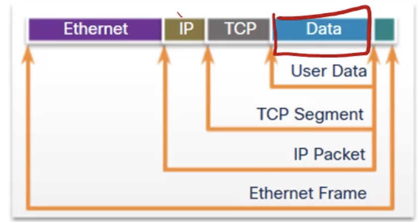
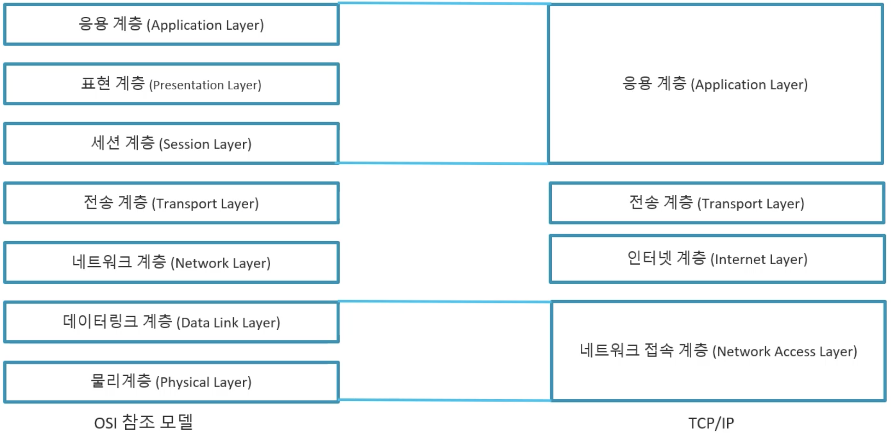
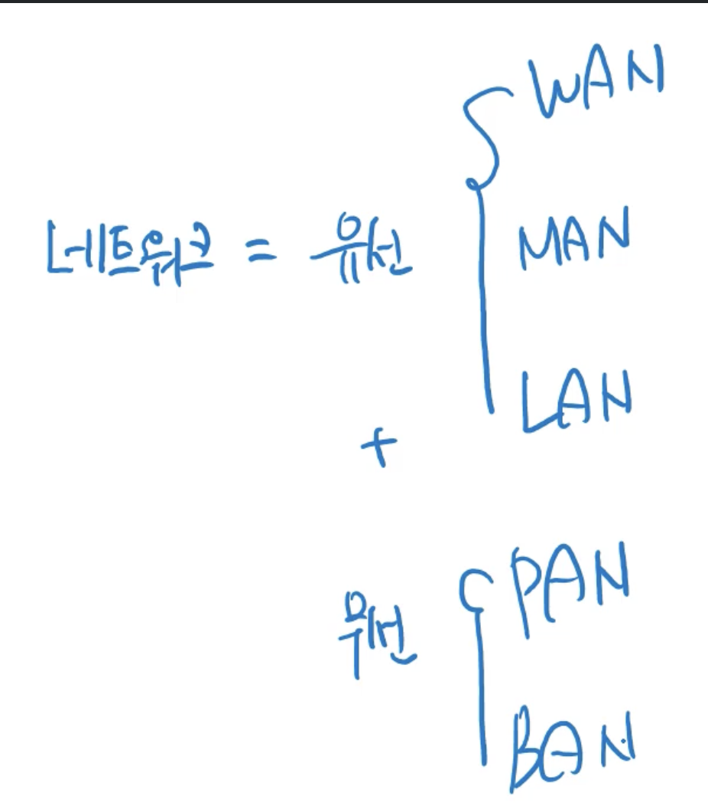
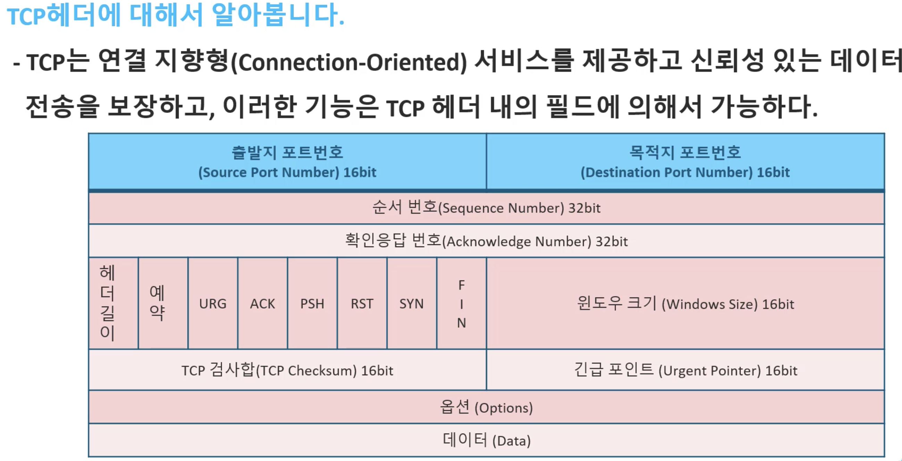
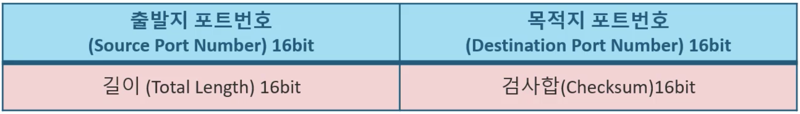
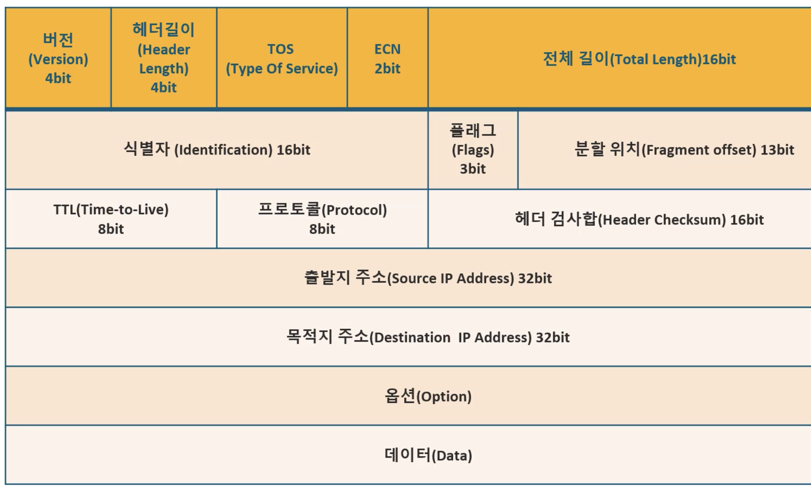

 http: TCP/80
 https: TCP/443

 ### L4 | Transportation Layer, 전송 계층

 - segment 단위로 통신
 - segment header는 port number와 socket address를 지닌다.
 - end-to-end error를 감시함
 - 흐름 제어 | 혼잡 제어 | 오류 제어 

 ### L5 | Session Layer, 세션 계층

 - Message 단위로 통신
 - 하나의 통신을 정의하는 단위가 Message

 ### L6 | Presentation Layer, 표현 계층

 - 데이터의 형식을 정의하는 레이어
 
### L7 | Application Layer, 응용 계층

 - 응용 프로그램 ~ 통신 프로그램을 연결
 - HTTP(TCP/80), SMTP, SNMP, Telnet(TCP/23), SSH(TCP/22), FTP, HTTPS(TCP/443) 등등...
 - 사용자 친화적 프로토콜 다수 존재

### 계층의 캡슐화

계층을 오르며/내리며 헤더를 붙이고 떼는 것을 En/De-capsulation이라 한다.

2<->1계층 시 2계층에서는 오류를 체크하는 Trailer가 붙는다.

### TCP/IP

인터넷 통신의 기본적인 프로토콜, 4개 계층으로 구성됨

TCP - Service

IP - Address 

#### 네크워크 종류

 * PAN: bluetooth 정도의 거리의 무선 통신
 * BAN: 스마트 워치 - 스마트폰 정도 거리의 무선 통신
 * MAN: LAN + LAN

 ### Network Access Layer

  - Frame 송/수신
  - ARP, RARP

### Transport Layer

  - TCP, UDP, IP 등등 세션을 정의하며 통신한다.  

### TCP의 신뢰성 통신

TCP는 MTU 단위로 쪼개진 각 Segment에 대해 ACK를 전송한다. 모든 Seg가 ACK되어야 전송이 끝난 것으로 간주한다.

예) 11개 데이터 전송, 3, 4 실패 => ACK 3 => 3부터 다시 전송하게 됨
이때 5~11은 Duplicate Segment로 오버헤드가 된다.
### TCP HEADER

QoS

URG: Urgency
ACK: ACK 신호
PSH: Push
RST: reset
SYN: sync
FIN: Final
Windows Size: ACK를 반환받을 최소 Segment 크기
예) 2 => Seg 2개마다 ACk 1개 받음

### UDP HEADER

UDP는 빠르고 간결함

비연결형 서비스 구현 (Connection을 보장하지 않음)

실시간 서비스를 구현

### IP HEADER

L3에서 Packet 단위로 송수신.

IP는 최선형(Best Effort, 작업은 되어있으나 패킷의 전달이 100% 이루어지는 것은 보장하지 않음) 서

순서가 보장되지 않음(Sequence Number가 없음)

이런 단점을 TCP, UDP와 혼용하여 보완 