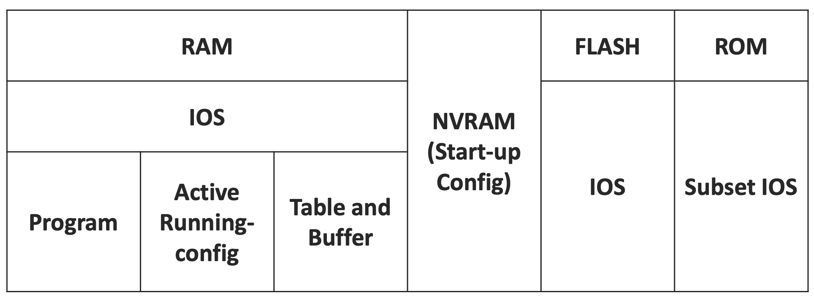
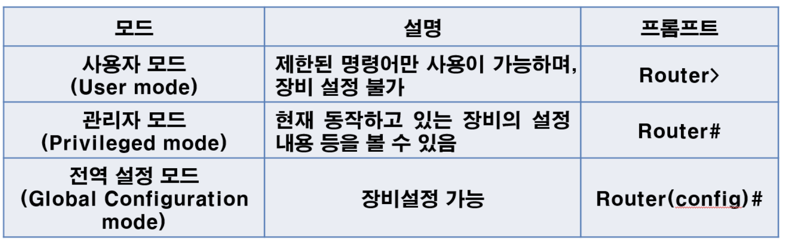
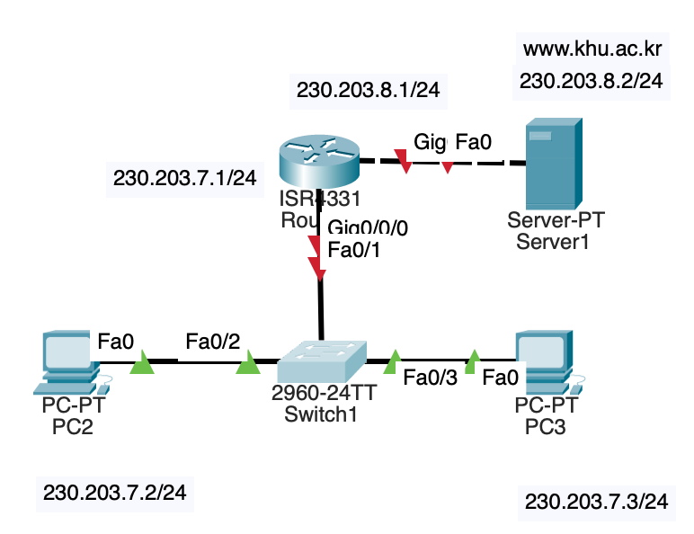

### 시스코의 라우터와 스위치

* 라우터 스위치의 OS는 IOS(Internetwork OS)이다.
* IOS는 OS인 동시에 시스템 SW로서 작동한다. 
* 동일한 장치라도 OS Lisence에 따라 지원하지 않는 기능이 있다. 
* 라우터, 스위치는 GUI, CLI 모두로 구성 가능하다.

### 라우터, 스위치의 HW 구성

RAM, FLASH, ROM 모두에 IOS가 설치되어 있다. FLASH의 IOS를 업데이트하거나 디버그할 때 ROM의 Subset IOS를 사용한다.

또한 장치의 password 설정 시에도 Subset IOS를 사용한다. 

Active Running-config는 재부팅 시 휘발하므로 
NVRAM의 재부팅 시 실행되는 Start-up Config를 사용하면 영구 저장이 가능하다.

'copy running-config startup-config' 또는 'wr' command로 Running의 내용을 Startup으로 복사할 수 있다.

### 부팅 순서

1. POST - Power On Self Test
    * 전원을 킬 때 셀프 점검
2. ROM의 Bootloader를 RAM으로 옮김
3. Bootloader가 FLASH의 IOS를 RAM으로 옮김
4. RAM에서 IOS 실행
5. NVRAM의 Config 적용(Optional)

### 라우터/스위치의 3가지 Mode

각 명령어는 알맞은 mode에서 사용해야 한다.

- User -> Privilleged : `en`, `enable`
- Privilleged -> Global Configuration: `conf t`, `configure terminal`

`exit` 으로 직전 mode로 돌아갈 수 있다. 

각각의 mode 진입 시의 password를 각각 설정할 수 있다.

#### Console password

> `Router(config)# line console 0`  
> `Router(config-line)# password <pass>`

User -> Privilleged 진입 시 사용

#### Enable password

> `Router(config)# enable password <pass>`

Privilleged -> Global 진입 시 사용

### Example

Router는 Broadcast Domain을, Switch는 Collision Domain을 나눈다.

#### Broadcast Domain
* Router-Server, 
* Router-Swtich-...
#### Collision Domain:
* PC2-PC3-Switch1

### CLI로 라우터 포트 설정하기

5주차 PPT 10p 참고.

### 사설 IP와 공인 IP

* ISP에서 할당받은 주소를 공인 IP라 한다. 
* 네트워크 관리자가 할당한 IP를 사설 IP라 한다.

### 서브넷 마스크

A 클래스는 8bit(`255.0.0.0`),
B 클래스는 16bit(`255.255.0.0`),
C 클래스는 24bit(`255.255.255.0`)의 기본 서브넷 마스크를 가진다.

    203.230.7.1/24

의 `24`는 서브넷 마스크의 bit 수를 나타낸다.

### IP의 클래스

#### A
    
    0.0.0.0 ~ 127.255.255.255

`10.0.0.0 ~ 10.255.255.255`의 범위는 사설 IP 대역이다.

#### B
    
    128.0.0.0 ~ 191.255.255.255

`172.16.0.0 ~ 172.31.255.255`의 범위는 사설 IP 대역이다.

#### C

    192.0.0.0 ~ 223.255.255.255

`192.168.0.0 ~ 192.168.255.255` 는 사설 IP 대역이다.

#### D

* 멀티캐스트에 의해 사용됨
* 일반 장치에 할당할 수 없음

#### E

* 연구 등 용도로 예약됨
* 일반 장치에 할당할 수 없음

### 공유기의 역할

* 공인 IP를 받아 해당 네트워크 내부의 사설 IP로 나누어준다.
* 이때, Port와 사설 IP를 1:1로 연결한다. 

### Network ID

    203.230.7.0/24

위와 같이, 서브넷 마스크 연산의 결과인 Host Field가 0인 IP주소는 해당 네트워크의 식별자로서 사용되며 일반 기기에 할당되지 않는다.

### Broadcast Address

    203.230.7.255

위 IP 주소는 Broadcast에 사용되며 일반 기기에 할당되지 않는다.

따라서 일반 기기에 할당 가능한 Host Field의 범위는 `[1, 254]`이며, 가능한 사설 IP 대역은 `192.168.10.1~192.168.10.254`이다.

