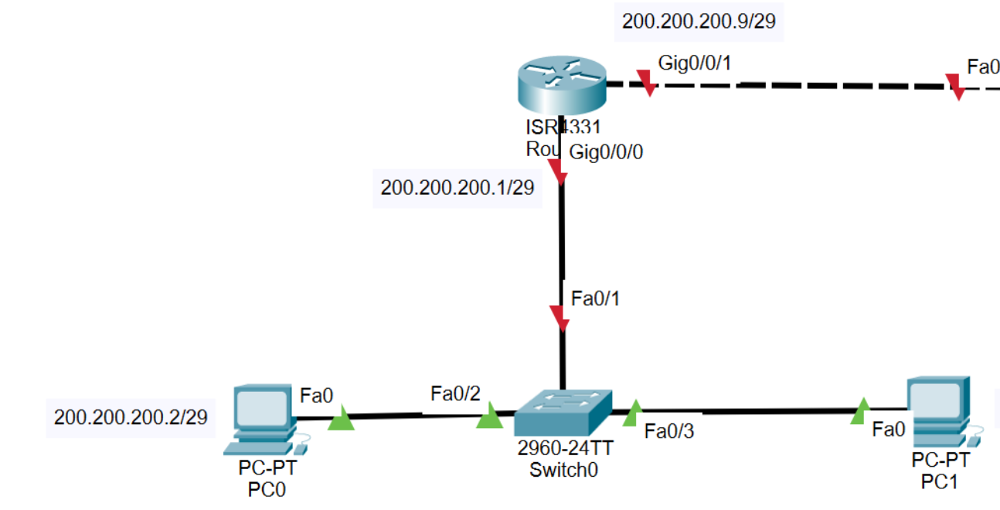
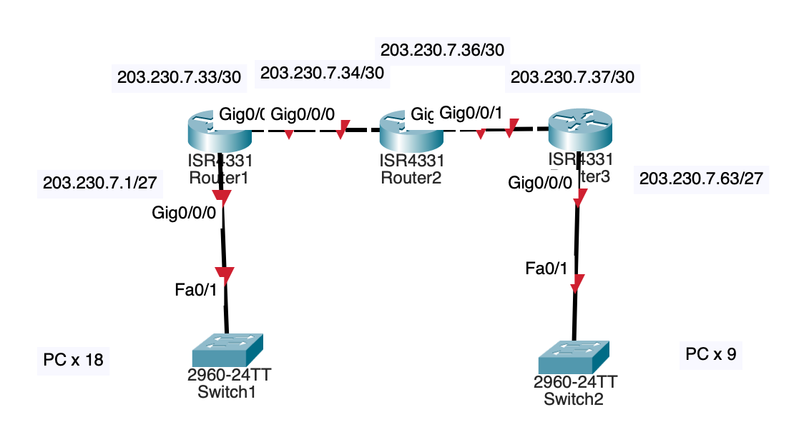
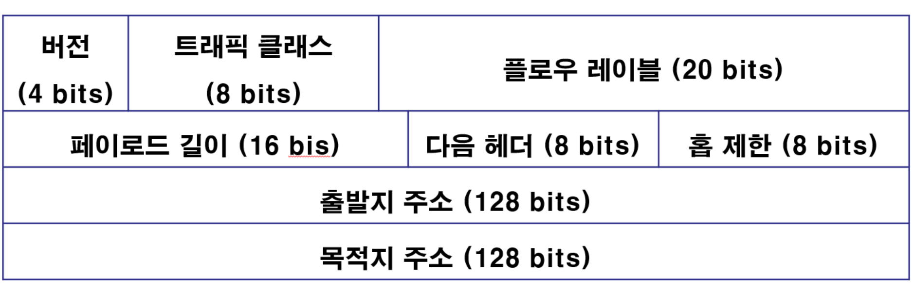

## IPv4의 주소 부족을 해결하는 법

v6으로 넘어가지 않는 이유는 네트워크의 가상화와 더불어 다음 3가지 기술이 개발되었기 때문이다.

### 1. Subnetting

한 네트워크에서 1, 2만 할당되면 해당 네트워크에는 3~254까지의 IP가 낭비되는 셈이다.


따라서 서브넷 마스크의 비트 수를 변경하여 한 네트워크의 내부 호스트 수를 조절한다. 



이 경우, 라우터, PC의 3개의 IP에 더하여 네트워크 IP, 서브넷 마스크까지 하여 총 5개의 IP가 필요하므로 29비트의 서브넷 마스크를 사용하는 것이 최적이다. 



이렇게 Subnetting된 네트워크를 한번 더 쪼갤 수도 있다.

이를 `VLSM`이라 한다.

### 2. DHCP | Dynamic Host Configuration Protocol

TCP/IP 기반 통신에 필요한 설정 정보를 자동으로 할당

DHCP Client는 다음과 같은 과정을 통해 설정을 할당받는다.

#### 1. DHCP Discover | Broadcast

DHCP Server의 MAC 주소를 찾는다.

|DEST MAC|SOURCE MAC|DEST IP|SOURCE IP|
|---|---|---|---|
|FF:FF:FF:FF:FF:FF|m2|255.255.255.255|0.0.0.0|

Broadcast이므로 Switch는 Flooding한다.

#### 2. DHCP Offer | Broadcast or Unicast

DHCP Server를 여럿 찾은 경우, 제일 먼저 도착한 / 동시에 도착한 경우 랜덤한 Server의 설정을 할당한다.

#### 3. DHCP Request | Broadcast

할당한 정보를 다시 Server로 보낸다.

#### 4. DHCP ACK | Broadcast or Unicast

Server는 본인의 설정을 할당한 것인지 확인하고 본인이라면 ACK를 보낸다.


#### ip-helper-address

Router는 Broadcast 통신을 네트워크 외부로 내보내지 않으므로 DHCP Server가 외부에 있는 경우 동적 할당이 불가능하다. 이를 가능하게 해 주는 것이 해당 커맨드이다.

### 2-1. DHCPv6

IPv4는 보안이 취약하다.

IPv6은 통신 시 기본 Header에 더하여 확장 Header를 둔 후, 그곳에 IPSec(AH, ESP) 프로토콜을 포함시켜 안전하다. 

- AH: 패킷 전송 시 변경 감지
- ESP: 데이터 암호화 / 변경 감지

#### IPv6 기본 헤더



v6의 헤더가 더 간결하므로 v6이 더 빠르다(미세하긴 함)

> 5주차 33p ~ 36p

주소 생략이 가능하다.
* 각 필드에서 선행하는 0은 생략할 수 있다. 
    ```
    0221=>221, 00AB=>AB, 0000=>0
    ```
* 뒤에 나오는 0은 생략할 수 없다. 
    ```
    F207 => F207, 4004=>4002
    ```
* 0으로만 나타난 연속된 필드는 0을 모두 삭제하고 2개의 콜론 또는 이중 콜론으로 나타낼 수 있다.

* 이때, 이중 콜론은 주소당 한 번만 사용 가능하고, 선행과 후행에 관계 없이 사용할 수 있다.
    ```
    BEAF : 0 : 0 : 0 : 0 : ABC : 0 : FFFF => BEAF :: ABC : 0 : FFFF
    ```

#### Network Prefix

Subnet Mask의 역할을 하며, /64 길이가 기본이다.

#### Interface Identifier

MAC 주소를 기반으로 생성되며, 특정 호스트를 식별하기 위해서 사용한다.
- 글로벌 주소 : IPv4의 공인 IP주소와 동일한 개념의 주소이며, 유일성을 가지면서
라우팅 되는 주소이다. 2001::/16, 2002::/16, 2003::/18, 3FFE::/16을 주로
사용한다.
- 링크 로컬 주소 : Link-Local Address는 같은 네트워크 내에서만 유효하며, 라우팅이 안된다.
- 로컬 주소 : 사설 네트워크 주소 대역이다. FC00::/7 대역을 가진다.

#### IPv6 SLAAC | Stateless Address Auto Configuration

호스트가 네트워크에 연결되면 Router는 주기적으로 RA(Router Advertisement)를 Broadcast한다. 

호스트는 받은 RA와 자신의 MAC Address를 기반으로 EUI-64 Interface Identifier를 생성한다.

또한 RA에서 추출한 Network Prefix와 IID를 바탕으로 자신의 IPv6을 생성한다. 중복을 확인한 후 할당한다. 

### 3. NAT

=
