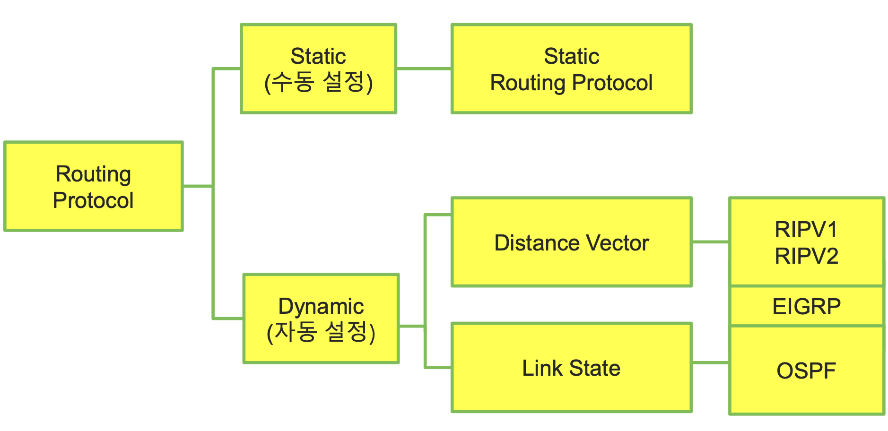
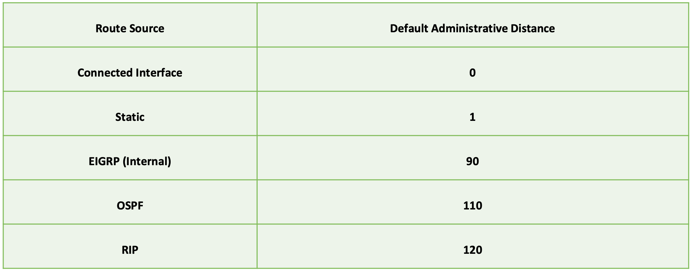

## Routing Protocol

라우터가 외부 네트워크, 즉 연결되어 있지 않은 Broadcast Domain에 대한 정보를 얻는 프로토콜.

### nine-five percent Rule

네트워크에 속하는 End Device는 99.999%의 확률로 인터넷 통신을 할 수 있어야 한다.

모든 디바이스가 그러한 경우에 네트워크를 stable하다고 본다.

### Static Routing

- 모든 경로를 수동으로 설정
- 조금이라도 복잡해지면 유동적 대처와 관리가 어려워진다.
    * 최근 ML, LLM(Answerable) 기반으로 수동 라우팅을 하는 경향 존재
- 별도의 Routing Protocol을 위한 통신이 필요없어 DR보다 가벼움
    * Static Routing Protocol

> 6주차 4p - 명령어 configuration 참고

#### Default Static Routing

    ip route 0.0.0.0 0.0.0.0 {ip | interface}

항상 어떤 요청이든 설정된 ip 또는 int에 있는 라우터로 보낸다.

Routing Table에서 `S*`로 표현된다.

### Dynamic Routing

#### Administrative Distance

2개 이상의 RP가 선언된 경우 사용의 우선순위를 결정한다.

값이 작을수록 우선순위가 높다.

***

* ### Distance Vector RP

    - 30초 주기로 라우팅 테이블을 자신과 직접 연결된 장치에 broadcast(오버헤드의 원인)
    - 네트워크 변화가 없어도 그냥 전송
    - 규모가 커질수록 업데이트 시의 전송 데이터가 커지므로 소규모에 적합
    - 또한 네트워크 규모가 클수록 `Convergence Time`(동기화에 걸리는 시간)이 기하급수적으로 증가
    - 15대 이상의 라우터가 있을 경우 통신이 거의 불가능(`Hop Count, (라우터 1대를 지날 때 카운팅) ≤ 15`)

    * ### RIPV1 (Routing Information Protocol Version 1)

        - `UDP/520`
        - 무조건 짧은 경로(`min{Hop Count}`)를 사용
        > `R 203.230.9.0/24 [120/1]`  
        > `R {ip}/{SubnetMask} [AdminDist/HopCount]`

    * ### RIPV2

        - 립 사용시 무조건 `V2`
        - `Multicast` 통신 | 네트워크 정보 + 서브넷 마스크 정보
        - `Hop Count`가 같은 경로가 존재하는 경우 번갈아서 보냄(`Equal-Cost Load Balancing`)

***

* ### Link State RP

    - DVRP의 단점을 보완 => `Convergence Time`이 매우 짧음

    * ### OSPF

        2017년까지 시스코 라우터에서만 쓸 수 있었다. 

* ### EIGRP
    