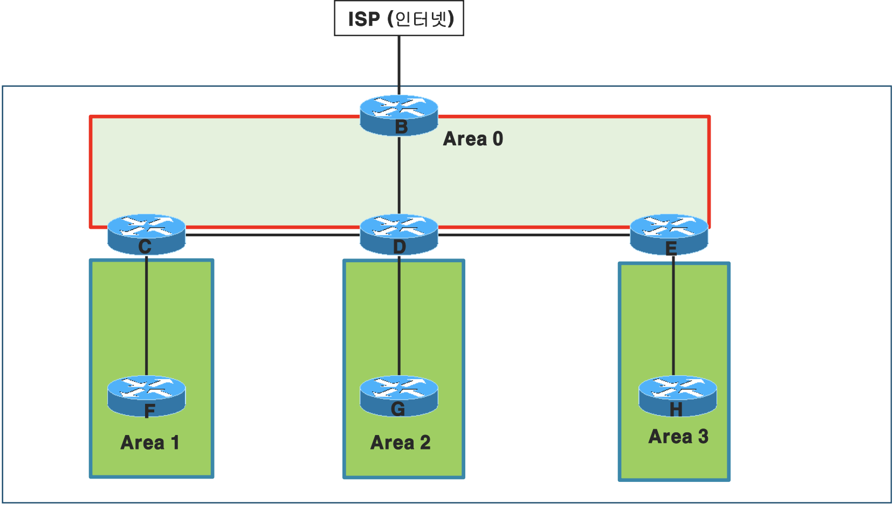

## RIP 이후 알고리즘의 공통점

1. `Hello Message`를 주고받으며 서로 동일한 RP인지 확인한다.
    이후 `neighbor 관계`를 맺는다.
2. `neighbor`끼리는 `Topology table`을 공유한다. 
3. 이후 다익스트라 or SPF 알고리즘을 통해 최적의 경로를 탐색한다. 

## Link State RP

직접 연결된 네트워크의 정보를 동일 네트워크의 라우터에게 보낸다.
이때 `Link State Packet(LSP)`를 생성하며, 이는 네트워크 링크에 대한 `Cost`정보를 갖는다.

`bandwidth`가 크면 `cost`가 작다.

## Enhanced Interior Gateway RP(EIGRP)

DVRP와 Link State의 장점만을 가지므로 
`Advanced Distance Vector RP`라고 불리기도 한다.

Cisco 전용(이었던 것)이며, 224.0.0.10의 Multicast Address를 사용한다.

Classless RP - Subnetting과 VLSM을 지원한다.

Partial Update - 경로의 변화가 있을 때만 Update를 한다.

MD5 알고리즘을 통해 서로 간 인증이 필요(가능)하며, 
DUAL(Diffusing Update ALgorithm)을 통해 (경로 오류 시 등 업데이트 시)최적 경로를 선출한다.
첫 연산 시에는 기본 알고리즘 쓰고 이후 업데이트로 유지보수 시에만 DUAL이 사용됨.

### DUAL

### EIGRP Packets

- ### Hello Packet

    - neighbor 유지에 사용
    - 기간마다 다시 보냄
    - hold time 안에 상대 패킷 없음 연결 해제

- ### Update Packet

    - 라우팅 정보 보낼 때 사용
    - 경로 변화 시만 사용

- ### Query Packet

    - 경로 요청 패킷

- ### Reply Packet

    - Query Packet에 대한 대답

- ### Acknowledgement Packet

    - Hello 제외하고 Update, Query, Reply의 수신 확인용

### Terms
- ### Neighbor Table
- ### Topology Table
- ### Routing Table
- ### Feasible Distance
    출발지 라우터

- ### Advertised Distance

### EIGRP Topology의 관리

FS를 통해 빠른 수렴이 가능하다.

Successor는 FD가 같은 경우 두 개 이상 선출 가능하다.

### K Value
|K|Value|Mean|
|---|---|---|
|K1|1|송-수신지 사이 가장 작은 bandwidth|
|K2|0|Load|
|K3|1|경로에 따른 누적 Delay|
|K4|0|신뢰성|
|K5|0|MTU|

K Value가 모두 동일하며 AS가 같은 경우, 인접하다고 판단 가능하다.

- #### AS
    ISP에서 전달해주는 번호

### Metric

## OSPF RP

- 가장 많이 사용되는, 표준 개방형 프로토콜
- Link-State를 사용한다.
- 업데이트 내용이 없어도 30분 간격으로 Link-State Refresh를 한다.

- #### DBD
- #### LSR
- #### LSU
- #### LSAck 

- ### OSPF의 계층 구조

무조건 `Area 0`를 거쳐 통신해야 한다. `Backborn Area`라고도 부른다.

근데 전체 토폴로지를 Area 0으로 설정해도 상관은 없다. 

#### Loopback Address(1.1.1.1)
- Loopback Interface에 할당됨

라우터의 Interface는 물리적(실제), 논리적(가상)으로 나뉜다.
가상 인터페이스의 대표적인 예시가 Loopback이다. 이는 외부 접속 시 일회성 ip 등으로 쓰인다.

`ip [AD/Metric]ss`

#### CLI Configrurations

CLI

    R1
en
conf t
hostname R1
int gi0/0/0
ip add 203.230.7.1 255.255.255.0
no shut
exit
int se0/2/0
ip add 203.230.8.1 255.255.255.0
clock rate 64000
no shut
exit
int s0/2/1
ip add 203.230.11.2 255.255.255.0
clock rate 64000
no shut
exit
router rip
version 2
network 203.230.7.0
network 203.230.8.0
network 203.230.11.0
exit

R3
en
conf t
hostname R3
int gi0/0/0
ip add 203.230.10.1 255.255.255.0
no shut
exit
int se0/2/0
ip add 203.230.9.2 255.255.255.0
no shut
exit
int s0/2/1
ip add 203.230.11.1 255.255.255.0
no shut
exit
router rip
version 2
network 203.230.9.0
network 203.230.10.0
network 203.230.11.0
exit

R2
en
conf t
hostname R2
int se0/2/0
ip add 203.230.8.2 255.255.255.0
no shut
exit
int s0/2/1
ip add 203.230.9.1 255.255.255.0
clock rate 64000
no shut
exit
router rip
version 2
network 203.230.9.0
network 203.230.8.0
exit

R1 static
en
conf t
ip route 203.230.10.2 255.255.255.255 203.230.8.2

hello message 를 주고 받는다.  : 동일한 라우팅 프로토콜인지 확인.
neighbor  (이웃) 관계를 설정한다. 
Topology 테이블을 서로 교환한다. 
알고리즘을 사용하여 최적의 경로를 선출한다

Eigrp Routing configuration
R1
en
conf t
hostname R1
int gi0/0/0
ip add 203.230.7.1 255.255.255.0
no shut
exit
int se0/2/0
ip add 203.230.8.1 255.255.255.0
clock rate 64000
no shut
exit
int s0/2/1
ip add 203.230.11.2 255.255.255.0
clock rate 64000
no shut
exit
router eigrp 7
network 203.230.7.0
network 203.230.8.0
network 203.230.11.0
exit

R3
en
conf t
hostname R3
int gi0/0/0
ip add 203.230.10.1 255.255.255.0
no shut
exit
int se0/2/0
ip add 203.230.9.2 255.255.255.0
no shut
exit
int s0/2/1
ip add 203.230.11.1 255.255.255.0
no shut
exit
router eigrp 7
network 203.230.9.0
network 203.230.10.0
network 203.230.11.0
exit

R2
en
conf t
hostname R2
int se0/2/0
ip add 203.230.8.2 255.255.255.0
no shut
exit
int s0/2/1
ip add 203.230.9.1 255.255.255.0
clock rate 64000
no shut
exit
router eigrp 7
network 203.230.9.0
network 203.230.8.0
exit

OSPF에서는  Area 0 구간을 다른 말로 Backbone Area 라고 부르기도 한다. 

loopback 주소. => loopback  인터페이스에 할당된다. 

라우터 인터페이스는 2가지로 나뉜다. 
물리적인 인터페이스
논리적인 인터페이스 :   라우터의 운영체제를 기반으로 만들어진 실제 인터페이스가 아닌 가상의 인터페이스를 논리적인 인터페이스라고 하고, 대표적인 인터페이스가 loopback  인터페이스 이다. 
ex)  만드는 방법
en
conf t
int loopback 0
ip add 1.1.1.1 255.255.255.0

가상 인터페이스는 자동으로 활성화가 되므로, no shut  명령어를 사용해서 활성화를 할 필요가 없다. 

위와 같이 잘 만들어진 것을 확인 할 수 있다. 

R1(config)#no int loopback 0
이 명령어를 이용하여 인터페이스를 삭제할 수 있다. 

OSPF configruation 
R1
en
conf t
hostname R1
int gi0/0/0
ip add 203.230.7.1 255.255.255.0
no shut
exit
int se0/2/0
ip add 203.230.8.1 255.255.255.0
clock rate 64000
no shut
exit
int s0/2/1
ip add 203.230.11.2 255.255.255.0
clock rate 64000
no shut
exit
router ospf 7
network 203.230.7.0 0.0.0.255 area 0
network 203.230.8.0 0.0.0.255 area 0
network 203.230.11.0 0.0.0.255 area 0
exit

R3
en
conf t
hostname R3
int gi0/0/0
ip add 203.230.10.1 255.255.255.0
no shut
exit
int se0/2/0
ip add 203.230.9.2 255.255.255.0
no shut
exit
int s0/2/1
ip add 203.230.11.1 255.255.255.0
no shut
exit
router ospf 7
network 203.230.9.0 0.0.0.255 area 0
network 203.230.10.0 0.0.0.255 area 0
network 203.230.11.0 0.0.0.255 area 0
exit

R2
en
conf t
hostname R2
int se0/2/0
ip add 203.230.8.2 255.255.255.0
no shut
exit
int s0/2/1
ip add 203.230.9.1 255.255.255.0
clock rate 64000
no shut
exit
router ospf 7
network 203.230.9.0 0.0.0.255 area 0
network 203.230.8.0 0.0.0.255 area 0
exit

